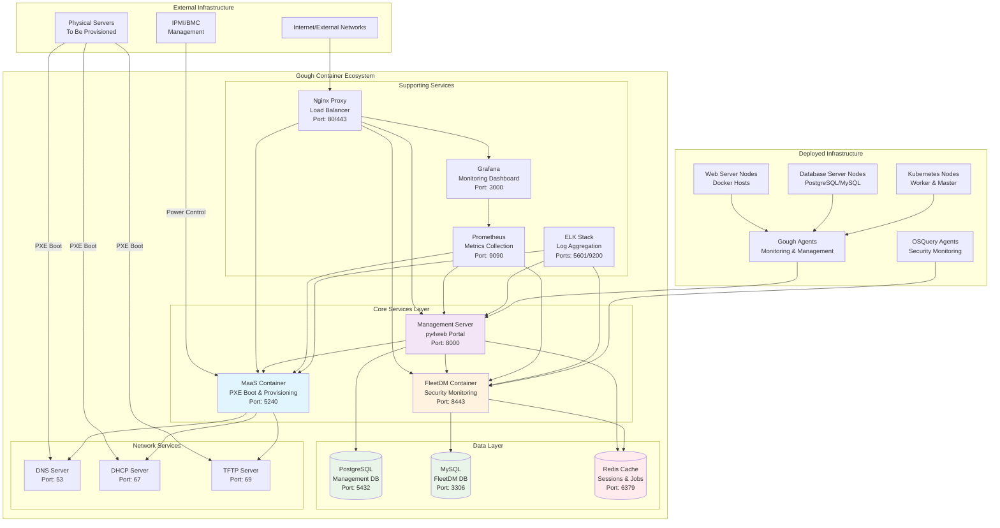
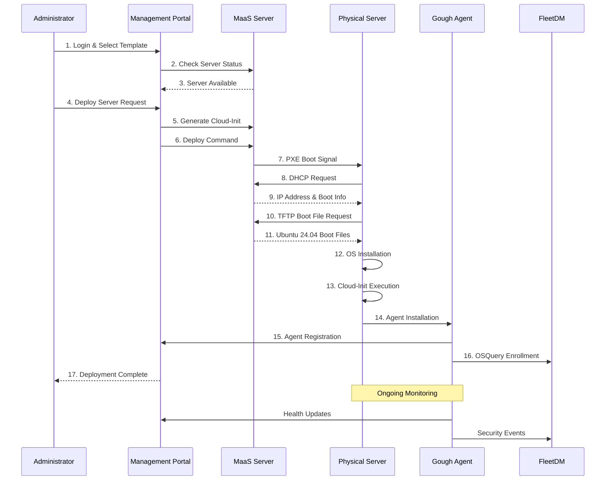
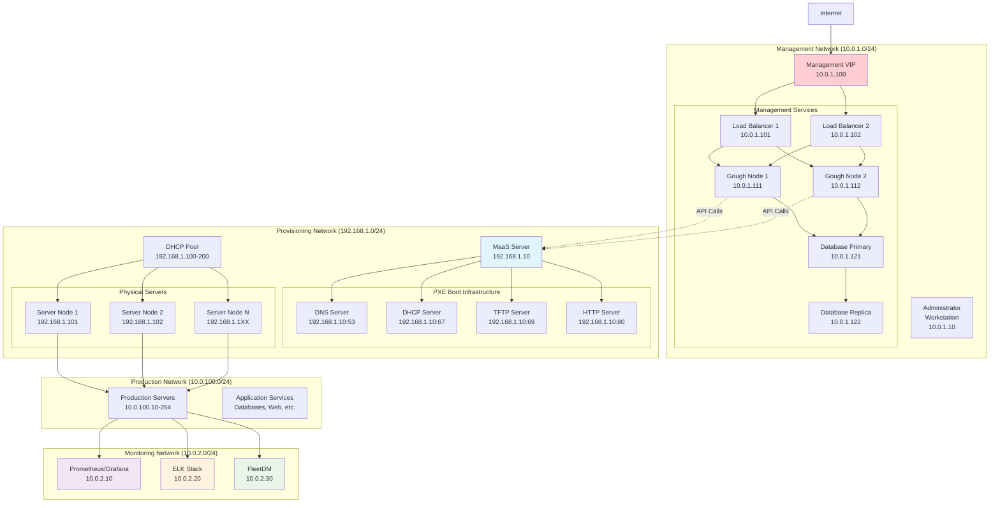
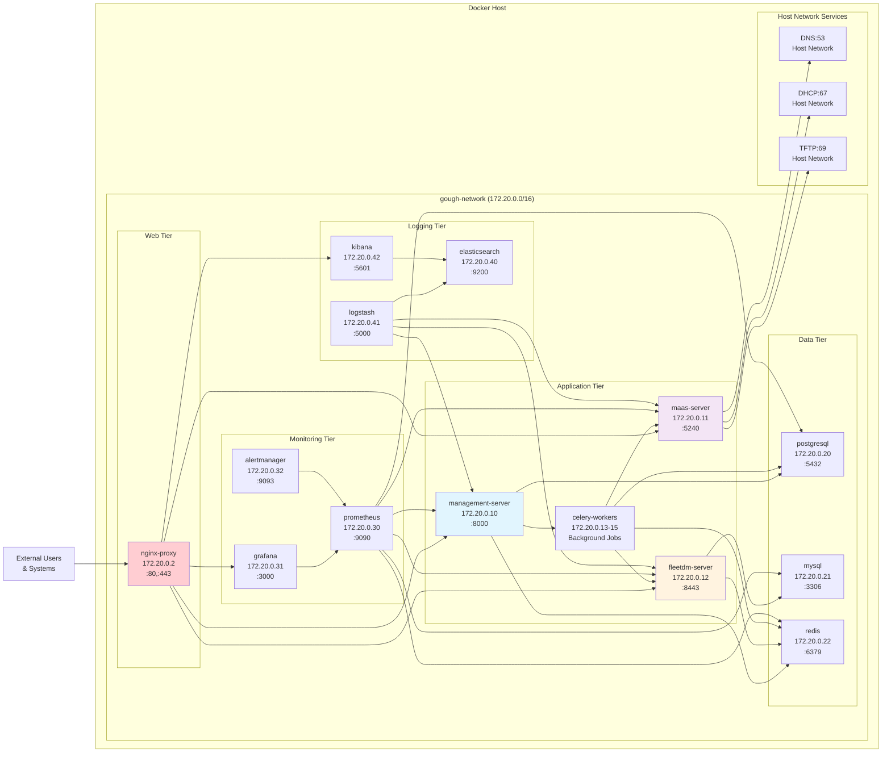
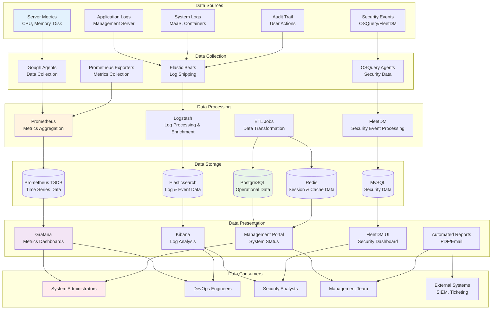
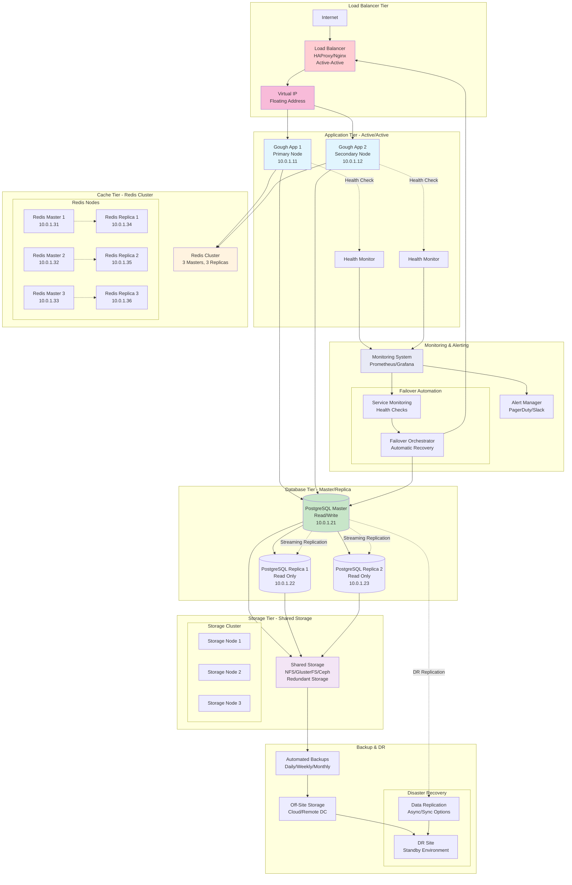

# Detailed System Architecture Diagrams

This document provides comprehensive architectural diagrams and visual representations of the Gough hypervisor automation system.

## System Overview Diagram

## Deployment Flow Diagram

## Network Architecture Diagram

## Container Interaction Diagram

## Security Architecture Diagram

```mermaid
graph TB
    subgraph "Security Perimeters"
        subgraph "DMZ (Demilitarized Zone)"
            WebProxy[Web Proxy/WAF<br/>Public Access Point]
            JumpHost[Jump Host/Bastion<br/>Secure Access]
        end
        
        subgraph "Management Zone"
            subgraph "Identity & Access"
                Auth[Authentication Service<br/>JWT/LDAP Integration]
                RBAC[Role-Based Access Control<br/>Permission Management]
                Vault[Secret Management<br/>API Keys & Certificates]
            end
            
            subgraph "Core Security"
                TLS[TLS Termination<br/>Certificate Management]
                APIGateway[API Gateway<br/>Rate Limiting & Filtering]
                AuditLog[Audit Logging<br/>Security Event Tracking]
            end
        end
        
        subgraph "Service Zone"
            subgraph "Application Security"
                AppSec[Application Firewall<br/>Input Validation]
                SQLSec[Database Security<br/>Encrypted Connections]
                ContainerSec[Container Security<br/>Runtime Protection]
            end
            
            subgraph "Network Security"
                NetSeg[Network Segmentation<br/>VLANs & Firewalls]
                Monitoring[Security Monitoring<br/>IDS/IPS]
                Encryption[Encryption at Rest<br/>& in Transit]
            end
        end
        
        subgraph "Data Zone"
            subgraph "Data Protection"
                DBEncryption[Database Encryption<br/>TDE & Column Level]
                BackupSec[Backup Security<br/>Encrypted Backups]
                DataGov[Data Governance<br/>Classification & Retention]
            end
        end
        
        subgraph "Monitoring Zone"
            subgraph "Security Operations"
                SIEM[SIEM Platform<br/>ELK Stack Integration]
                SOC[Security Operations<br/>Incident Response]
                Compliance[Compliance Monitoring<br/>Policy Enforcement]
            end
        end
    end
    
    Internet[Internet] --> WebProxy
    WebProxy --> JumpHost
    JumpHost --> Auth
    Auth --> RBAC
    RBAC --> Vault
    
    Vault --> TLS
    TLS --> APIGateway
    APIGateway --> AuditLog
    
    AuditLog --> AppSec
    AppSec --> SQLSec
    SQLSec --> ContainerSec
    
    ContainerSec --> NetSeg
    NetSeg --> Monitoring
    Monitoring --> Encryption
    
    Encryption --> DBEncryption
    DBEncryption --> BackupSec
    BackupSec --> DataGov
    
    DataGov --> SIEM
    SIEM --> SOC
    SOC --> Compliance
    
    style WebProxy fill:#ffcdd2
    style Auth fill:#e1f5fe
    style Vault fill:#f3e5f5
    style SIEM fill:#fff3e0
    style Compliance fill:#e8f5e8
```

## Data Flow Architecture

## High Availability Architecture

This comprehensive set of architectural diagrams provides detailed visual representations of the Gough system's structure, data flows, security model, and high availability configuration. Each diagram serves a specific purpose:

1. **System Overview**: Complete system topology and component relationships
2. **Deployment Flow**: Step-by-step server provisioning process
3. **Network Architecture**: Network segmentation and communication paths
4. **Container Interaction**: Docker container communication and dependencies
5. **Security Architecture**: Multi-layered security controls and boundaries
6. **Data Flow**: Information flow from collection to presentation
7. **High Availability**: Redundancy and failover mechanisms

These diagrams can be used for:
- System documentation and training
- Architecture reviews and planning
- Troubleshooting and incident response
- Compliance and security audits
- Capacity planning and scaling decisions